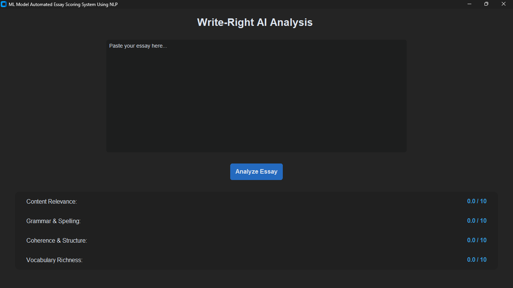

# CodeAlpha_Machine_Learning_Internship
My internship projects at CodeAlpha focused on Machine Learning and NLP (Student ID: CA/SE3/4912).

# 📝 Write-Right AI: Automated Essay Scoring System

[cite_start]A Machine Learning project developed during my internship at **CodeAlpha** (Student ID: CA/SE3/4912)[cite: 5, 7, 8]. This system uses Natural Language Processing (NLP) to provide instant, objective feedback on academic writing.

---

## 🚀 Project Overview
The objective of this task was to build a machine learning model that automatically scores essays based on four critical pillars: **Content Relevance, Grammar & Spelling, Coherence & Structure, and Vocabulary Richness**.

## 📸 Dashboard Preview

*A modern, dark-themed GUI built using CustomTkinter.*

---

## 🔍 How it Works (NLP Pipeline)
The system processes text through several stages to ensure an accurate score:

1. **Preprocessing**: Tokenization and stopword removal using NLTK.
2. **Relevance Analysis**: Utilizing **TF-IDF Vectorization** and **Cosine Similarity** to check topic alignment.
3. **Feature Engineering**: Calculating sentence complexity, grammatical errors, and lexical diversity.
4. **Scoring**: A final weighted score is generated out of 10.


---

## 🛠️ Technical Stack
* **Language**: Python
* **NLP Libraries**: NLTK (Natural Language Toolkit)
* **Machine Learning**: Scikit-Learn (TfidfVectorizer)
* **UI Framework**: CustomTkinter
* **Techniques**: TF-IDF, Word Embeddings, and Feature Engineering

---

## ⚙️ Installation & Usage

1. **Clone the repo**:
   ```bash
   git clone [https://github.com/YOUR_GITHUB_USERNAME/automated-essay-scorer.git](https://github.com/YOUR_GITHUB_USERNAME/automated-essay-scorer.git)